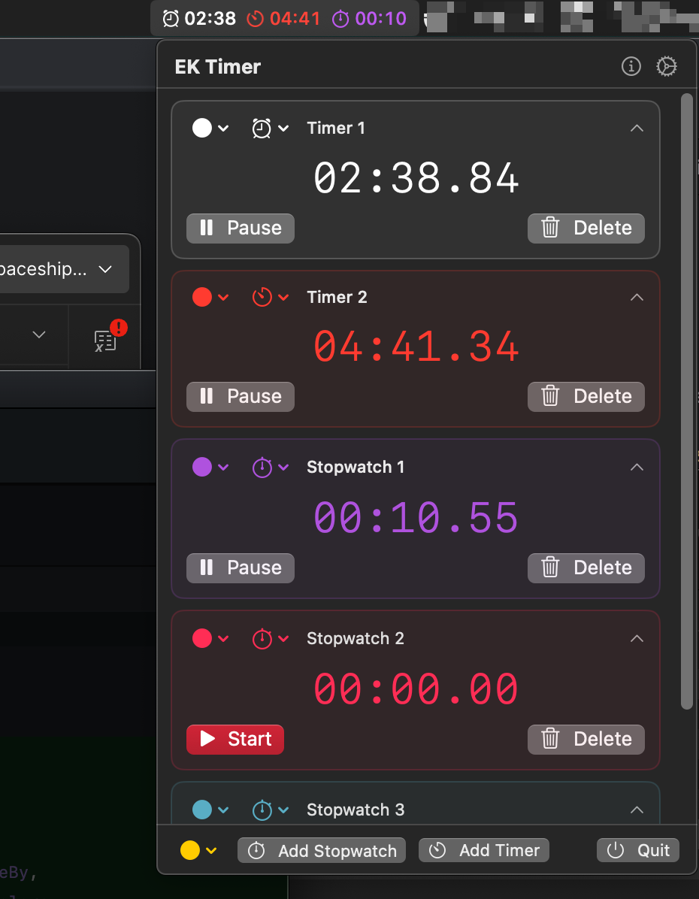
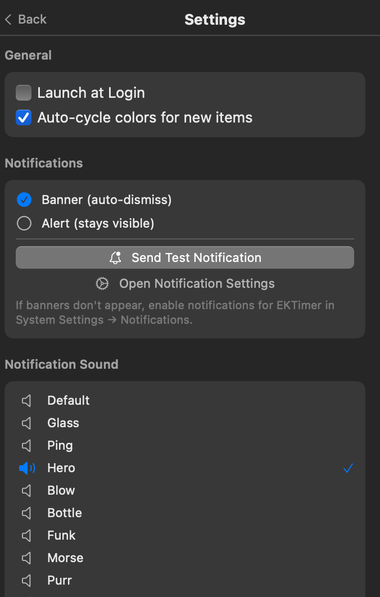
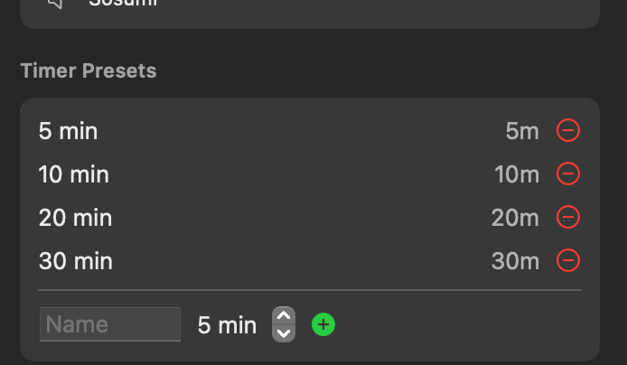
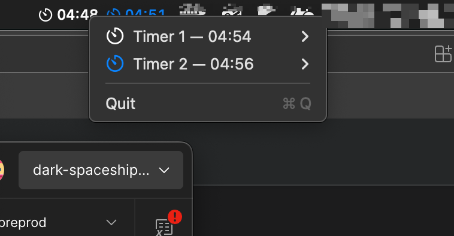

# EKTimer

A lightweight menu bar timer and stopwatch app for macOS.


## Features

- **Menu bar app** — lives in the status bar, no dock icon
- **Multiple concurrent timers** — run as many stopwatches and countdown timers as you need
- **Custom colors** — 9 colors (white, blue, green, orange, red, purple, pink, teal, yellow) with auto-cycle option
- **Custom icons** — 20 icons to choose from (stopwatch, flame, heart, star, dumbbell, and more)
- **Editable labels** — auto-generated names (Timer 1, Stopwatch 2) that you can customize
- **Timer presets** — quick-start with 5, 10, 20, or 30 minute presets, plus custom time input
- **Colored menu bar** — each timer shows its icon and time in its assigned color directly in the menu bar
- **Right-click menu** — start, pause, restart, remove timers and change color/icon without opening the app
- **Notifications** — banner or alert style with 12 selectable sounds (Glass, Ping, Hero, and more)
- **Dark mode** — app icon adapts to light/dark appearance
- **Settings** — launch at login, auto-cycle colors, notification style/sound, editable presets
- **Keyboard shortcut** — Cmd+Q to quit

## Screenshots

Main panel showing multiple concurrent timers and stopwatches with colored menu bar icons:



Settings view (general, notifications, sounds):



Timer presets editor:



Menu bar:




## Installation

### Download

Download the latest `EKTimer-1.0.0.dmg` from [Releases](../../releases), open it, and drag **EKTimer** to **Applications**.

### Build from source

Requires macOS 14+ and Swift 6 (Xcode 16+).

```bash
git clone <repo-url>
cd ektimer

# Build and run
./Scripts/run.sh

# Build only (produces EKTimer.app)
./Scripts/build.sh

# Create DMG installer
./Scripts/create-dmg.sh
```

## Project Structure

```
├── Package.swift                    # Swift Package Manager manifest
├── Resources/
│   ├── Info.plist                   # App bundle configuration
│   ├── AppIcon.icns                 # App icon
│   ├── icon_light.png               # Light mode icon
│   └── icon_dark.png                # Dark mode icon
├── Scripts/
│   ├── build.sh                     # Build release .app bundle
│   ├── run.sh                       # Build and launch
│   └── create-dmg.sh               # Create DMG installer
└── Sources/EKTimer/
    ├── App/
    │   ├── EKTimerApp.swift         # App entry point (MenuBarExtra)
    │   └── AppDelegate.swift        # Notifications, Cmd+Q, right-click menu
    ├── Models/
    │   ├── TimerMode.swift          # Stopwatch / Timer enum
    │   ├── TimerState.swift         # Idle / Running / Paused / Finished
    │   ├── TimerColor.swift         # 9 color options
    │   ├── TimerIcon.swift          # 20 icon options
    │   ├── TimerPreset.swift        # Configurable presets
    │   ├── NotificationStyle.swift  # Banner / Alert
    │   └── NotificationSound.swift  # 12 macOS system sounds
    ├── Services/
    │   ├── TimerInstance.swift       # Core timing logic (date-based, drift-free)
    │   ├── TimerManager.swift        # Collection manager
    │   ├── NotificationService.swift # UNUserNotificationCenter + NSSound
    │   └── LaunchAtLoginService.swift# SMAppService wrapper
    └── Views/
        ├── ContentView.swift         # Main panel with timer list
        ├── MenuBarLabel.swift        # Colored icons + times in menu bar
        ├── TimerRowView.swift        # Per-timer card with controls
        ├── SettingsView.swift        # Settings panel
        ├── PresetEditorView.swift    # Timer preset editor
        └── Components/
            ├── TimeDisplayView.swift       # Time display + editable time input
            ├── ControlButtonsView.swift    # Start/Pause/Resume/Reset/Delete
            └── AppIconView.swift           # Appearance-aware app icon
```

## Tech Stack

- **SwiftUI** with `MenuBarExtra` and `.menuBarExtraStyle(.window)`
- **Swift Observation** (`@Observable`) for reactive state
- **Combine** (`Timer.publish`) for tick updates
- **AppKit** for colored menu bar rendering (`NSImage` with `isTemplate = false`)
- **UNUserNotificationCenter** for timer completion alerts
- **SMAppService** for launch at login
- **Swift Package Manager** — no Xcode project needed

## Requirements

- macOS 14 (Sonoma) or later
- Swift 6 / Xcode 16+ (for building from source)

## Author

Created by **Eniz K.**

## License

This project is open source and available under the [MIT License](LICENSE).
